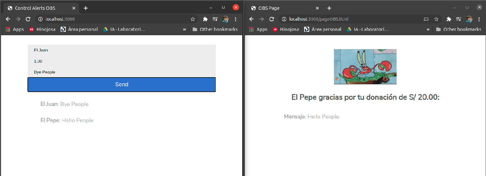
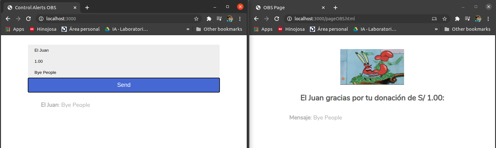

# Alerts with audio to Streaming(OBS, StreamlabsOBS)
Audio alerts from text, made in nodeJS with socketIO. This project was made to be used in a streaming of DOTA2 tournament.\
It was done because we wanted to use another payment gateway for donations (YAPE)

## Content
Each commit is a progress of the project

## Demo
This project was used for the Facebook broadcast of a DOTA 2 tournament [Facebook Live of tournament](#)

## Installation
To install and run this project just type and execute
```bash
npm install
npm run dev
```

## Handbook
- The control page is a index of the project
```bash
http://localhost:3000/
```
- the page that will go to browser source on OBS is
```bash
http://localhost:3000/pageOBS.html
```
- The messages will accumulate, and will be reproduced one by one
- The audio source is in control page
```bash
http://localhost:3000/
```

## Preview




